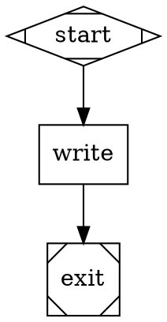
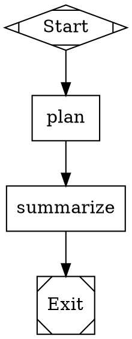
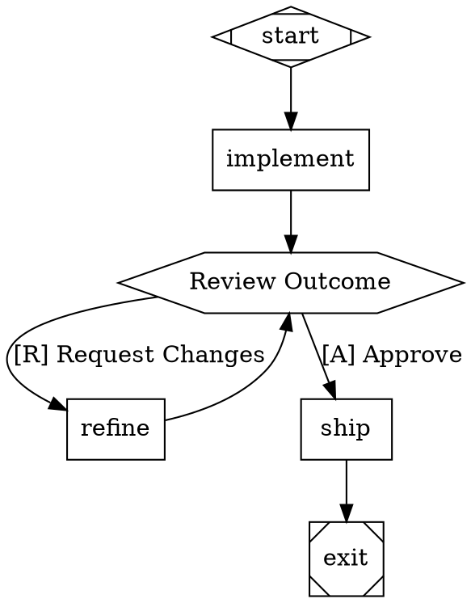
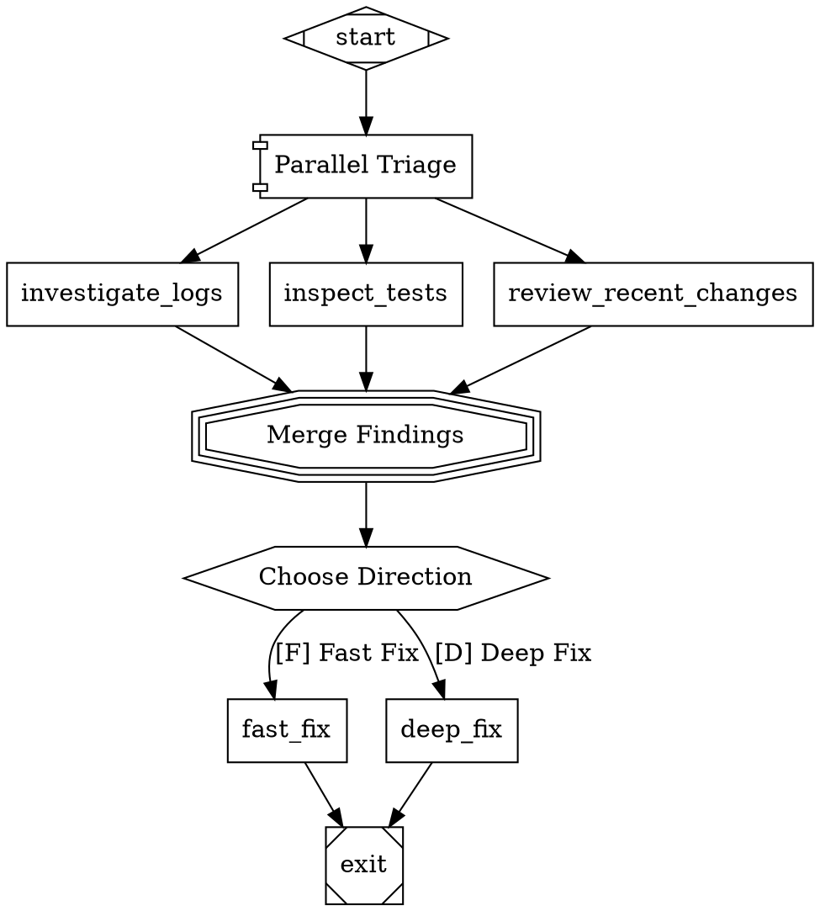

# Forge

Forge is a Rust workspace implementing a spec-first software factory stack. It orchestrates multi-stage AI workflows using directed graphs defined in Graphviz DOT syntax — nodes are tasks (LLM calls, human reviews, tool executions, conditional branches), and edges define the flow between them.

Upstream spec references:

- Attractor ecosystem source: https://github.com/strongdm/attractor
- Factory vision: https://factory.strongdm.ai/

## Quick Start

### Prerequisites

- **Rust toolchain** (nightly 1.95.0+): `rustup install nightly`
- **An LLM API key** (for real execution): `OPENAI_API_KEY` or `ANTHROPIC_API_KEY`

### Build

```bash
cargo build
```

### Run Your First Pipeline

```bash
# Dry-run with mock backend (no API key needed)
cargo run -p forge-cli -- run --dot-file examples/01-linear-foundation.dot --backend mock

# Real execution with an LLM backend
export OPENAI_API_KEY="sk-..."
cargo run -p forge-cli -- run --dot-file examples/01-linear-foundation.dot --backend agent
```

## How Pipelines Work

A Forge pipeline is a `.dot` file — a directed graph where:

- **Nodes** are tasks (LLM prompts, human gates, tool calls, parallel fan-outs)
- **Edges** are transitions with optional conditions and weights
- **Attributes** configure behavior (retries, goals, model selection)

The engine walks the graph from the start node to the exit node, executing each handler and selecting the next edge based on the outcome.

### Minimal Pipeline



Save as `hello.dot` and run:

```bash
cargo run -p forge-cli -- run --dot-file hello.dot --backend mock
```

### Node Types (Shapes)

| Shape           | Type              | What It Does |
|-----------------|-------------------|--------------|
| `Mdiamond`      | Start             | Entry point (every pipeline needs exactly one) |
| `Msquare`       | Exit              | Exit point (every pipeline needs exactly one) |
| `box`           | Codergen (LLM)    | Calls an LLM with a prompt. Default for plain nodes. |
| `hexagon`       | Wait.Human (HITL) | Pauses for human input — presents edge labels as choices |
| `diamond`       | Conditional       | Pass-through; the engine evaluates edge conditions |
| `component`     | Parallel          | Fans out to multiple branches concurrently |
| `tripleoctagon` | Fan-In            | Consolidates parallel branch results |
| `parallelogram` | Tool              | Executes a shell command |
| `house`         | Manager Loop      | Supervisor polling loop for child pipelines |

### Edge Conditions

Edges can have conditions that control routing based on the previous node's outcome:

```dot
implement -> review [condition="outcome=success"]
implement -> retry  [condition="outcome=fail"]
```

Conditions support `=`, `!=`, `&&`, and context variable lookups (`context.key=value`).

### Goal Gates

Mark critical nodes with `goal_gate=true` — the pipeline won't exit successfully unless all goal gates have succeeded:

```dot
implement [shape=box, prompt="Write the code", goal_gate=true]
test      [shape=box, prompt="Run tests",      goal_gate=true]
```

If a goal gate hasn't succeeded when the engine reaches the exit node, it routes to `retry_target` instead.

### Human-in-the-Loop

Use `hexagon` nodes to pause for human decisions. The outgoing edge labels become the choices:

```dot
review [shape=hexagon, label="Review"]
review -> approve [label="[A] Approve"]
review -> revise  [label="[R] Request Changes"]
```

### Model Stylesheet

Configure which LLM model handles which nodes using a CSS-like stylesheet:

```dot
graph [model_stylesheet="
    * { llm_model: gpt-4o; llm_provider: openai; }
    .critical { llm_model: claude-opus-4-6; llm_provider: anthropic; }
    #final_review { reasoning_effort: high; }
"]
```

Specificity order: `*` (universal) < shape name < `.class` < `#node_id`.

## CLI Reference

### `forge-cli run` — Start a Pipeline

```bash
cargo run -p forge-cli -- run [OPTIONS]
```

**Pipeline source** (one required):
- `--dot-file <PATH>` — Path to a `.dot` file
- `--dot-source <STRING>` — Inline DOT source

**Options:**
- `--backend <MODE>` — Execution backend (default: `agent`)
  - `agent` — Forge agent with LLM provider from environment
  - `mock` — Dry-run mode, no LLM calls
  - `claude-code` — Claude Code CLI adapter
  - `codex-cli` — Codex CLI adapter
  - `gemini-cli` — Gemini CLI adapter
- `--interviewer <MODE>` — Human-in-the-loop mode (default: `auto`)
  - `auto` — Console if interactive terminal, else auto-approve
  - `console` — Always prompt in terminal
  - `queue` — Use pre-loaded answers from `--human-answer`
- `--human-answer <STRING>` — Pre-loaded answer (repeatable, for `queue` mode)
- `--run-id <ID>` — Custom run identifier
- `--logs-root <PATH>` — Root directory for artifacts
- `--event-json` — Output events as JSON lines
- `--no-stream-events` — Disable event streaming

### `forge-cli resume` — Resume from Checkpoint

```bash
cargo run -p forge-cli -- resume --checkpoint <PATH> --dot-file <PATH> [OPTIONS]
```

Same options as `run`, plus:
- `--checkpoint <PATH>` — Path to checkpoint file (required)

### `forge-cli inspect-checkpoint` — View Checkpoint Details

```bash
cargo run -p forge-cli -- inspect-checkpoint --checkpoint <PATH> [--json]
```

## Example Pipelines

### 1. Linear Pipeline

A simple plan → summarize flow:



### 2. Human Review Gate

A pipeline with human approval and a revision loop:



### 3. Parallel Fan-Out with Human Decision

Three investigation branches run in parallel, merge results, then a human picks the direction:



See `examples/` for runnable versions of these pipelines.

## Workspace Crates

| Crate | Path | Purpose |
|-------|------|---------|
| `forge-llm` | `crates/forge-llm` | Unified multi-provider LLM client (OpenAI + Anthropic) |
| `forge-agent` | `crates/forge-agent` | Coding agent loop (session state machine, tools, provider profiles) |
| `forge-attractor` | `crates/forge-attractor` | DOT pipeline parser, graph IR, execution engine, and node handlers |
| `forge-cli` | `crates/forge-cli` | CLI binary for running, resuming, and inspecting pipelines |
| `forge-cxdb-runtime` | `crates/forge-cxdb-runtime` | CXDB runtime integration (persistence contracts, typed store, fakes) |
| `forge-cxdb` | `crates/forge-cxdb` | Vendored CXDB client SDK (binary protocol, TLS, reconnect) |

## Testing

Forge has three tiers of tests. All `#[ignore]`d tests fail hard if their prerequisites are missing — no silent skipping.

### Tier 1: Default (no external deps)

```bash
cargo test                                   # 647 tests, all deterministic
cargo test -p forge-attractor --tests        # attractor integration tests
cargo test -p forge-llm                      # LLM client tests
cargo test -p forge-agent                    # agent tests
cargo test -p forge-cli --tests              # CLI smoke tests
cargo test -p forge-cxdb-runtime             # CXDB runtime tests (fakes)
```

### Tier 2: Infrastructure (no API keys)

These need local services or CLIs installed, but NOT API keys.

```bash
# CXDB tests — need running CXDB server on :9009/:9010
cargo test -p forge-cxdb-runtime --test live -- --ignored    # 7 tests
cargo test -p cxdb --test integration -- --ignored           # 2 tests

# CLI agent e2e — need claude/codex/gemini CLIs (OAuth, no API keys)
cargo test -p forge-llm --test cli_agent_e2e -- --ignored    # 9 tests
```

### Tier 3: Provider API keys (costs real money)

```bash
cargo test -p forge-llm --test openai_live -- --ignored       # needs OPENAI_API_KEY
cargo test -p forge-llm --test anthropic_live -- --ignored     # needs ANTHROPIC_API_KEY
cargo test -p forge-agent --test openai_live -- --ignored      # needs OPENAI_API_KEY
cargo test -p forge-agent --test anthropic_live -- --ignored   # needs ANTHROPIC_API_KEY
cargo test -p forge-attractor --test live -- --ignored         # needs OPENAI_API_KEY
```

## Environment Variables

| Variable | Purpose |
|----------|---------|
| `OPENAI_API_KEY` | OpenAI provider authentication |
| `ANTHROPIC_API_KEY` | Anthropic provider authentication |
| `OPENAI_BASE_URL` | Override OpenAI API endpoint |
| `ANTHROPIC_BASE_URL` | Override Anthropic API endpoint |
| `FORGE_CXDB_PERSISTENCE` | CXDB persistence mode (`off` or `required`) |
| `FORGE_CXDB_BINARY_ADDR` | CXDB binary protocol address |
| `FORGE_CXDB_HTTP_BASE_URL` | CXDB HTTP base URL |
| `FORGE_CLAUDE_BIN` | Path to Claude Code CLI binary |
| `FORGE_CODEX_BIN` | Path to Codex CLI binary |
| `FORGE_GEMINI_BIN` | Path to Gemini CLI binary |

## Specifications

Source-of-truth specs live in `spec/`:

- `spec/00-vision.md` — Vision, principles, techniques
- `spec/01-unified-llm-spec.md` — Unified LLM client
- `spec/02-coding-agent-loop-spec.md` — Coding agent loop
- `spec/03-attractor-spec.md` — Attractor pipeline orchestration
- `spec/04-cxdb-integration-spec.md` — CXDB persistence integration
- `spec/05-factory-control-plane-spec.md` — Factory control-plane
- `spec/06-unified-agent-provider-spec.md` — Unified agent provider

## Contributing

See `CONTRIBUTING.md` and `AGENTS.md` for coding standards, test expectations, and spec-alignment requirements.
