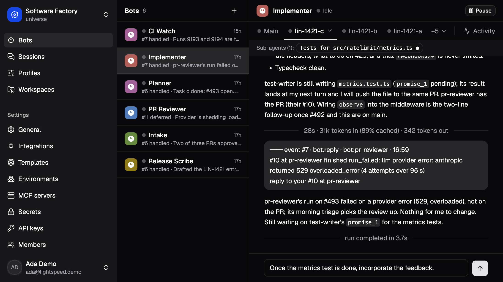

<p align="center">
  <a href="https://ls.bot/" target="_blank" rel="noopener">
    
  </a>
</p>

# Lightspeed

<p align="center"><strong>Run thousands of agents. Efficient, durable, auditable.</strong></p>

Lightspeed is open-source infrastructure for running long-lived agent fleets in
production.

It's a frontier-class agent harness that runs as a durable
workflow, borrows real machines when a task needs one, and stays auditable, tenant-isolated, and cheap when idle.

<p align="center">
  <a href="https://ls.bot/demo/u/software-factory/bots/implementer" target="_blank" rel="noopener">
    
  </a>
</p>

Lightspeed agents and sub-agents survive restarts, run for months, and scale to
thousands without needing a dedicated VM for each one.

[Temporal](https://temporal.io/) is fully supported today. We plan to support other engines in the future too: [Restate](https://www.restate.dev/), [Inngest](https://www.inngest.com/), Hatchet, AWS Step Functions, etc.

The core is written in Rust. The production data backend is Postgres and optional S3. Frontend is TS/React.

## Why?

**The goal of Lightspeed is to build as powerful an agent as Claude Code, Codex, or OpenClaw, but running _outside_ operating systems, thus separating the harness from compute. Plus, making this tenable for workflow engines**.

Concretely, that means the harness—the agent loop, context management, session state—runs as a lightweight durable workflow, while OS-level work (shells, code execution, full file systems) happens on machines the agent attaches to only when a task needs them. The result: thousands of agents managed by a single worker node.

<p align="center">
  
</p>

Frontier agent harnesses like Claude Code, Codex, OpenCode, or OpenClaw are designed to run inside a guest OS and need an entire OS for themselves, which makes them difficult to scale and secure. Hence the emerging pattern to ["separate the harness from compute"](https://openai.com/index/the-next-evolution-of-the-agents-sdk/#:~:text=long%2Drunning%20task.-,Separating%20harness%20from%20compute%20for%20security%2C%20durability%2C%20and%20scale,-Agent%20systems%20should), and to run agents inside workflow engines for durability. This is especially interesting in enterprise or shared deployments, where you cannot easily co-locate agents on the same VM.

But most agent SDKs are not designed for workflow engines: they do not separate the deterministic core from effects such as LLM or tool calls, and they pass too much data between the core workflow logic and the effectful "tasks" or "activities"—e.g. the entire chat history back and forth—which bloats workflow histories.

One caveat we take seriously: frontier models are optimized to the hilt (via RL) assuming they control a full POSIX-compatible OS, so an agent with just MCPs and provider-native tools will underperform one with a real machine. Bridging that gap is a central goal of Lightspeed: agents can borrow compute (dedicated VMs via a bridge daemon, ad-hoc sandboxes, delegated coding-agent jobs) while the harness stays outside the OS.

**What you can build with Lightspeed**:

- An insanely **scalable OpenClaw-style personal assistant**: thousands of users, very low cost (besides tokens)
- A fully **autonomous software factory**: a coordinator that runs sub-agents to build, test, and critique your next feature — and keeps running for weeks
- **Research agents** that spin up compute for long-running experiments, stay live for days, and supervise progress
- ...and much more!

## Quick start

You need Rust with edition 2024 support, Node.js 24 or newer, and Docker with
Compose. Then configure at least one model provider and start the complete
local product:

```bash
cp .env.example .env
# Set OPENAI_API_KEY or ANTHROPIC_API_KEY in .env
./dev.sh
```

When the readiness checks pass, open
[http://localhost:5173/app/](http://localhost:5173/app/) and sign in with the
development account printed by the launcher. The defaults are
`admin@lightspeed.dev` and `lightspeed-dev-password`.

That is the supported happy path. The launcher installs npm dependencies when
needed, starts the local infrastructure and editable application processes,
applies migrations, and waits until the product is ready.

For focused profiles, lifecycle commands, provider-free startup, connector
configuration, manual runtime roles, local service addresses, resets, and live
test setup, see the [development environment guide](scripts/dev/README.md).
Environment variables are documented separately in
[docs/variables.md](docs/variables.md).

## Features

Lightspeed covers the table stakes of a modern agent harness. Everything below works today. Run it with the [Quick start](#quick-start).

**Models & providers**

- [x] **OpenAI and Anthropic, provider-native**: reasoning traces, native compaction, advanced tool configs, provider tools, files and images, OAuth login, multiple API keys
- [x] **OpenAI-compatible providers**: OpenRouter, DeepSeek, vLLM, Ollama, and
  similar servers, each configured with its own endpoint and credential
- [x] **Prompt caching**: cache breakpoints and cache keys are placed
  automatically, context is append-only where it counts

**Agent capabilities**

- [x] **Virtual file system**: dedicated `vfs_*` tools read and edit linked
  snapshots/workspaces without an OS attached
- [x] **Web access**: fetch, search, and extract tools
- [x] **Skills**, automatically cataloged and loaded from linked VFS roots
- [x] **Hosted and native MCP**: connect servers with API keys or OAuth,
  discover tools automatically, and manage approvals from the web console or CLI. MCPs integration works via provider managed MCP or lightspeed injected tool calls (e.g. for local network MCP servers)
- [x] **Sub-agents**: `agent_run` / `agent_spawn` over allowlisted profiles, supervised by an execution workflow, with root-scoped limits and typed lineage
- [x] **Agent profiles**: reusable session setups, shared across clients and sub-agents

**Bots & channels**

Bots are Lightspeed's automation feature.

- [x] **Bots**: create always-on agents that wake up for scheduled tasks,
  incoming webhooks, data changes, or chat messages
- [x] **Bot federation**: bots can talk to each other and coordinate work.
- [x] **Timers, schedules, wake-ups**
- [x] **Triggers & Pollers**: Wake a bot through various triggers such as web hooks, VM based pollers, and so on. Bots can build their own triggers and set them up
- [x] **Chat channels**: Talk to bots via Telegram and WhatsApp


**Durability & scale**

- [x] **Long-running agents**: sessions that last weeks to months and survive restarts
- [x] **Active-run control**: cancel a run, steer it, or queue the next message behind the current run
- [x] **Session fork & clone**: cheap forks of a running agent's full state, straight from the event-sourced log
- [x] **Managed sessions and workflow-backed tools**: external workflows create
  sessions and add durable tools — deliveries, keyed completions, deadlines,
  cancellation — against the generated
  [workflow contract](crates/temporal-workflow/contract/workflow-contract.md)
- [x] **One backend binary**: `lightspeed-server` runs gateway, sessions,
  bots, and channels together by default. Start with a single process; but since Lightspeed is built around Temporal, you can easily spin as many parallel backend workers as you need.

**Borrowed compute**

- [x] **Dedicated VMs**: sessions run their file and process tools on a selected environment, provisioned by the in-repo Incus provider or attached as an existing machine
- [x] **Power states and idle policy**: environments pause, suspend, or stop on intent or after staged idle timeouts, and wake transparently on next use
- [x] **Environment jobs**: long-running work (downloads, experiments, delegated coding agents) runs as provider-owned jobs, exposed to the model as a default-off grant

**Security & auth**

- [x] **Encrypted secrets**: AEAD-encrypted secret store, plus an OAuth token broker with automatic refresh
- [x] **Credential injection**: secrets reach environments and jobs without ever being exposed to the model
- [x] **Multi-tenant by default**: universes isolate tenants on one deployment,
  and dedicated per-tenant deployments share the same platform
  ([docs](docs/multi-tenancy.md))

**Interfaces**

- [x] **Web app**: manage universes, sessions, profiles, bots, and channels
  from the browser
- [x] **Typed JSON-RPC API**: committed schema contract, generated TypeScript client
- [x] **Configurator MCP**: controll all of Lightspeed via MCP
- [x] **CLI** to connect to running sessions through a TUI, or to complete admin tasks 


## Design

At the heart of every agent is a carefully engineered state machine that manages what goes into the context window of the LLM.

In Lightspeed, that state machine is an event-sourced, deterministic core: it replays a session's event log into state, decides the next step, and emits effect _intents_ that runtime adapters execute against real LLM providers and tools. The core itself performs no I/O, which is exactly the shape that plays well with durable workflow engines.

Two more decisions make this practical inside a workflow engine:

1) **Minimal provider abstraction.** We extract only the information needed to decide and branch inside the deterministic core; provider-native data stays opaque and blob-backed, instead of being converted into a fake universal LLM message model.
2) **Offloading to CAS.** All data not directly needed by the workflow logic goes to content-addressed storage, so the payloads passed between workflow and activities are extremely thin and the workflow history stays small.

Lightspeed's plugin infrastructure lets external workflows add durable tools
to an agent. A plugin can create and manage a session, provide tools backed by
its own workflows, and rely on Lightspeed to deliver calls, wait for results,
handle timeouts, and cancel work. Plugins stay independent from the core
session worker.

Bots — durable event routers that own managed sessions — and the core of
Channels (chat conversations as bot triggers) run inside the same runtime:
`bots/*` and `channels/*` are ordinary API methods, bot controllers and
conversation workflows are Temporal workflows of the same server, and the
Telegram/WhatsApp bridges are a thin TypeScript connector host that speaks to
the core over `channels/inbound/admit` and three activities on its own task
queue. One `lightspeed-server` process runs every role by default
(`gateway`, `sessions`, `bots`, `channels`); `--roles` selects a subset and
`--task-types workflows|activities` splits a worker role further.

The full design walk-through is in [docs/design.md](docs/design.md).

<p align="center">
  
</p>

## Development checks

```bash
cargo test
npm run check
```

## Documentation

- [Design](docs/design.md)
- [Development environment](scripts/dev/README.md)
- [Environment variables](docs/variables.md)
- [Universes, tenant isolation, and gateway authentication](docs/multi-tenancy.md)
- [JSON-RPC API reference](crates/api/contract/api-reference.md)
- [Build and release](docs/releasing.md)
- [Roadmap and design decisions](docs/roadmap/)

## Contributing

See [CONTRIBUTING.md](CONTRIBUTING.md)

## License

[Apache 2.0](LICENSE)
