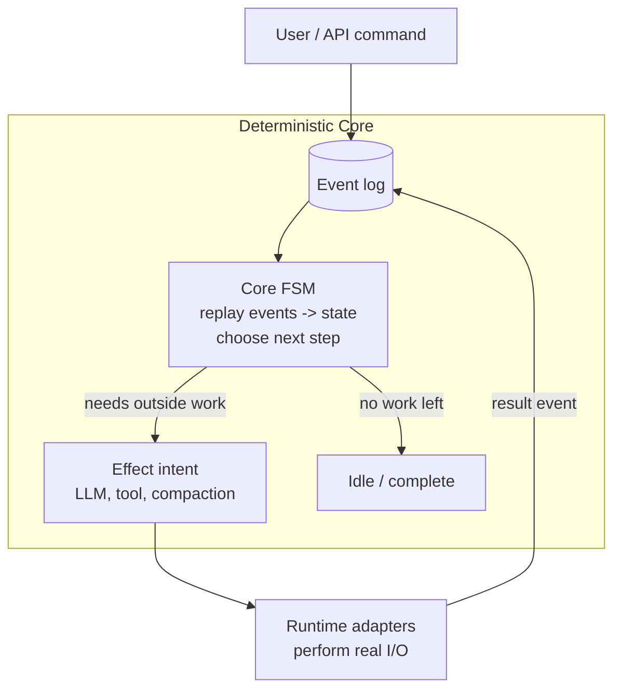
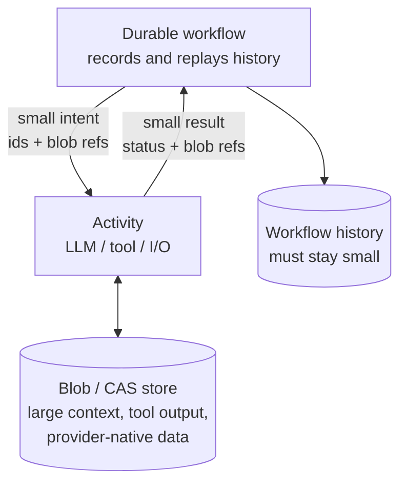
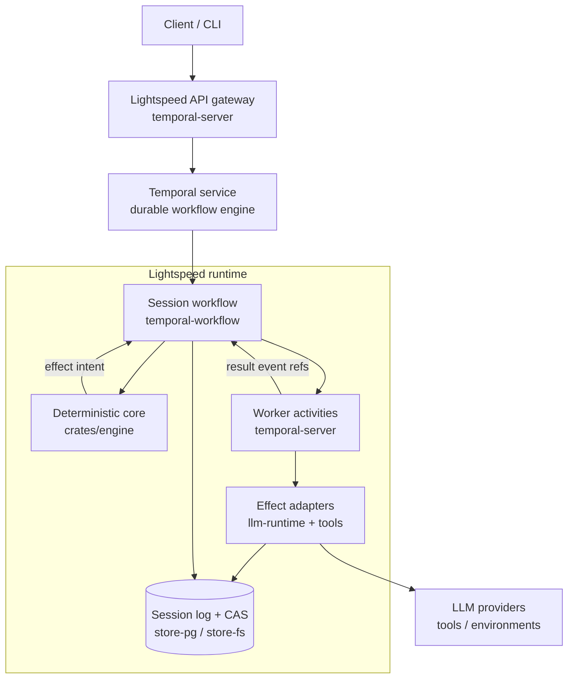

# Lightspeed Design

This is the design walk-through behind Lightspeed — see the [README](../README.md) for what it is and why it exists. It covers the deterministic core, context management, the CAS offloading seam, and how the pieces run inside a durable workflow engine such as Temporal.

At the heart of every agent is a carefully engineered state machine that manages what goes into the context window of the LLM. We start with that core and then layer various systems on top until we have a complete, working agent.

## Deterministic Core
The [core engine](../crates/engine/src/core/components/) is implemented as an event-sourced deterministic finite state machine.

> [!NOTE]
> The event log we are talking of here is separate from the Temporal event history (or other workflow). We are talking specifically of the events that constitute an agent's session state. These events are stored in Lightspeed's own Postgres event store.

When a command arrives, it is validated at the admission boundary, converted to an event, and recorded in the event log. The event is then applied to the core state. Then a "next step decider" figures out what to do next. If effects need to be issued, the decider outputs a list of effect _intents_, which then get executed against the LLM providers or tool call surfaces. The results of these effects get sent back to the event log to be recorded and then applied to the FSM, resulting in an event loop.

A concrete round: a user message is admitted and recorded; the decider plans an LLM turn intent; the LLM response comes back containing two tool calls and is recorded; the decider emits two tool intents; their results are recorded; the decider plans the next LLM turn — and so on, until there is no work left and the session goes idle.

This stack is entirely workflow engine agnostic, and it can be thoroughly tested in isolation by simulating the effect adapters.

## Context Management & Provider APIs
The purpose of the deterministic core is to decide what goes into the context window of the next LLM turn, plus the provider API configurations. Anything that does not pertain to this problem needs to live elsewhere. In Lightspeed, we call the history and state of an individual context window a _session_.

So, what are the things that need to feed into the LLM session?
1) Top-level instructions (prompts/system messages)
2) Configured tool definitions (including MCP)
3) Transcript/message items, which can be split further:
	- Inputs: user messages, business events
	- LLM output items: responses, reasoning traces, tool calls, compaction traces
	- Tool results
	- Actively managed transcript items: skill catalogs, memory subsystem, etc
4) (not in the context window) LLM configurations such as model, reasoning efforts

The main challenge is how to balance what goes into the context window each turn, what to retain when compacting the context window (because it is full), and how to do all this with as much LLM caching consistency as possible.

Lightspeed adds the _absolute minimal_ abstraction over the LLM provider data structures and APIs. Many agent SDKs (e.g. LangChain) convert the provider specific data into a unified structure and then convert it back when they pass it back to the LLM. We, on the other hand, extract only the information that is needed to decide and branch inside the deterministic core. The provider-native data is stored as blobs in content addressed storage.

Model selection records only `(providerId, apiKind, model)`. Transport stays
outside deterministic state: a universe-scoped `model:<providerId>` record is
resolved immediately before provider I/O and can supply an encrypted API key
or OAuth token plus an OpenAI-compatible base URL, non-secret headers, and an
explicit API-kind allowlist. Built-in OpenAI and Anthropic routes may fall
back to deployment configuration; custom provider ids must resolve a complete
endpoint record and never silently fall through to OpenAI. Credentialless
loopback records support local Ollama/vLLM servers, while public endpoints
require HTTPS.

Compaction follows the same philosophy: it is provider-native, not a homegrown summarizer. The core treats compaction as a first-class part of the session: it decides when the context window needs compacting, records a compaction-requested event, and marks the affected context pending until the compaction result event lands. The actual compaction runs through the provider's own mechanism (e.g. OpenAI Responses or Anthropic Messages compaction), so the compacted trace stays in the provider's native format.

## Offloading to CAS
Workflow engines differentiate between the deterministic code that expresses the business logic and the code that executes effects such as database calls or API calls, usually called "activities" or "tasks". This introduces an important seam that needs to be carefully managed. Specifically, the data that travels back and forth between workflow and activities needs to be kept to a minimum, because all those transitions are logged and stored (which is part of the magic that makes the workflows "durable").

Lightspeed solves this by offloading all data that is not directly needed by the workflow logic to a content addressed storage (CAS) system. The structures that are passed between workflow and activities are extremely thin, keeping workflow state and log size small and efficient. So, instead of passing, say, the entire user input message to the LLM activity, we first store it in the CAS and then only pass a reference to the blob, and vice versa with model outputs.

Context inputs, committed entries, and terminal outputs share one `ContentRef`:
`content_ref`, `media_type`, and `provider_kind` describe the immutable payload
and its decoding format. Context adds semantic kind, insertion source, preview,
and accounting. Its optional `provenance_ref` names an immutable origin or
construction artifact: source audio, a prompt assembly report, or a skill
catalog snapshot. Native provider IDs stay in the native payload and can be
projected for clients; they are not duplicated in reducer state.

Blobs are immutable and shared within a universe. Session appends and bot event
inserts derive deduplicated roots in their existing database transactions;
foreign keys prevent committing dangling references. Checkpoints and VFS
snapshots have their own foreign keys. Writers of nested formats (a VFS manifest
and its files, a tool output and its assets, a catalog and its documents) record
parent-to-child edges. Chat declaration documents retain their schemas and
descriptions, and bot events retain the receiver's declaration document.

A single background collector runs hourly, examining up to 100,000 catalog rows
per universe in pages of at most 1,024, subject to a shared 10-minute budget
checked between pages. It deletes old blobs with no holder or incoming edge.
Parent deletion releases children for later pages or passes. Each put and API
admission of existing refs refreshes the default seven-day grace; reads do not. Unique physical object keys let catalog deletion
commit before object cleanup without a delayed delete damaging a reupload.
Session deletion releases its roots; collection follows asynchronously after
grace and cursor traversal. Fingerprints that are hashes but not blobs carry a
distinguishing prefix so they never read as refs.

Profiles borrow their blob refs: use inline instructions or content retained by
another durable resource. Workflow state alone also does not retain blobs.
Ordinary activity handoffs fit within grace; an uncommitted handoff stalled
longer than grace may lose its blobs and require resubmission. There are no
generic workflow leases or per-activity retention writes. A chat conversation
reconstructs a collected declaration when another message arrives.

## Hosting inside a Workflow Runtime (e.g. Temporal)
With the above pieces in place, running an agent inside a workflow runtime becomes feasible and pleasant. We just have to put it all together.

The Temporal workflow owns an instance of the deterministic core — aka a "session". It drives the core state machine until it is idle. When not idle, it sends the effect intents via activities to real APIs and services, such as LLM providers. It also logs all events that constitute a session state in a Postgres store (or optionally a file system store, for testing). Small CAS blobs get stored in Postgres, large blobs go to S3 (also supporting different blob providers).

Commands reach a running session as Temporal signals: the gateway submits admissions (a validated command plus optional context key), the workflow queues them, and the drive loop admits them into the session log. A `status` query serves session state to the gateway without touching the log.

Because sessions can run for weeks to months and Temporal caps workflow history, the workflow continues-as-new whenever it is idle and Temporal suggests it (or a configured history threshold is crossed). This is where the event-sourced design pays off twice: the workflow start arguments are tiny—a session id, the session config, a blob ref for instructions—because the entire session state rehydrates from Lightspeed's own event log. Workflow history stays bounded no matter how long the agent lives, and a worker crash or deploy simply replays into the same state.

## The Client API Boundary
Clients — the CLI, workflow integrations, editors, and future frontends — consume the typed `api` crate surface through the JSON-RPC gateway, never the reducer internals. `session/runs/start` is an acceptance boundary, not a final-output boundary: it returns once the run is admitted, and clients follow `session/events/read` or refresh `session/read` for progress and completion. This keeps the public contract stable while the core evolves underneath it.

The web transcript starts with `session/events/read` using
`direction: "backward"`: a bounded event range ending at a captured session head,
returned chronologically. Its
exclusive `before` cursor walks backward to the beginning, including inherited
fork history. This path reads the event store directly and projects only the
selected range; it never reconstructs execution state or requires a reducer
checkpoint. An incomplete range fails explicitly rather than skipping history.
Forward updates start strictly after the initial captured head; subsequent
history reads cannot advance that live cursor. Windows may split even very
large runs, so the browser retains tool continuations, rebuilds the loaded
history chronologically, and keeps historical reconstruction separate from
live lifecycle state. Current execution state still uses checkpoint-backed
`session/read` and its dedicated active-run summary.

Collection reads do not fan out to Temporal workflows. `session/list` reads a
materialized `new` / `open` / `closed` lifecycle projection maintained in the
session-store transaction that appends lifecycle events; the event log remains
authoritative. Retention is opt-in per session tree: fresh sessions and
config-only clones own a nullable close-relative deletion policy, while
history forks and delegated children inherit that root. `session/delete`
removes only a closed leaf by default; explicit cascade and timed retention
atomically remove a fully closed fork/origin subtree. Config-only clones are
never included.

Agent profiles live on this boundary too: a profile is a reusable setup document for session config, instructions, workspace links, creation-time session metadata defaults, and environment selection. Explicit start metadata overrides profile defaults key by key; applying a profile later does not rewrite session metadata. A start may also retain a named profile while overriding its environment intent with an existing universe environment or none; omission uses the profile intent. Session config itself is a sparse, capability-oriented document: core sections (model, generation, limits, context) plus feature grants (vfs, web, subagents, timers, environments, mcp) where an absent feature is simply not granted — the default session is a model that can process runs and nothing else. `features.vfs.tools` grants dedicated `vfs_*` operations over linked snapshots/workspaces. `features.environments` grants ordinary file/process operations over the selected live environment; model-driven selection and advanced jobs remain separate, default-off sub-grants. The two filesystems are never fused or synchronized. Config is replaced whole via `session/config/put` guarded by an expected revision (no field-level patch vocabulary), and the session's toolset — including remote MCP tools declared under `features.mcp` — is derived from that document rather than managed imperatively. MCP server ids select universe-configured connections whose current auth grants resolve only at provider-send time; sessions and profiles select only the id, never a grant or per-session tool/approval policy. Management discovery uses the official Rust MCP SDK over current Streamable HTTP, reads the current inventory directly from the MCP server, and does not persist it. Universe environments remain live provider-backed resources; deterministic session state records only the active environment id. The hosted runtime resolves and applies profiles outside the deterministic core.

## Tools, Environments & Sub-agents

The engine's tool registry records admitted logical identities and execution
policy. Built-in entries carry small trusted settings, such as presentation
overrides and one-shot process behavior. Definitions live in runtime code and
are resolved directly into values when the LLM activity builds the catalog for
the effective turn model, including run overrides. Externally authored functions
and provider-native declarations continue to load their definition refs from
CAS; MCP inventories remain runtime-owned.

A shared built-in resolver selects the exposed name, description, schema,
argument adapter, and result renderer. One logical operation may expose several
tools: `env.continue_process` becomes `BashOutput` and `KillShell` on Anthropic.
The request-local reverse lookup admits only advertised client calls. Exposed
names must be unique, including injected MCP tools and hosted helpers. Specific
tool choice targets a registry identity and resolves to its primary exposure.
Built-in expansion preserves the previous exposed-name ordering and cache
breakpoints; externally authored request lists retain their supplied order.

Calls retain both the internal identity and the original exposed name.
Scheduling, workflow lookup, concurrency controls, and environment batch rules
use the identity. Native transcript items retain their original names,
arguments, and call ids. Execution uses the same resolver with the admitted
settings, originating turn model, and exposed variant carried on the activity
input. This also applies to retries and parked batches. There is no historical
built-in implementation registry or separately persisted resolved catalog:
replay reduces recorded facts without codecs, while activities execute the
currently deployed code with their original inputs.

Tool intents are executed by tool packages outside the core. A CAS-backed
virtual filesystem gives the agent dedicated `vfs_*` read/edit tools with no
operating system attached. Ordinary file tools, commands, and new jobs instead
consume the active environment id captured on the tool batch and operate only
inside that environment. Trusted logical bindings select the runtime domain;
there is no generic execution-target field and no shared filesystem router.
VFS prompts and the `skills.catalog.vfs` catalog refresh from linked workspace
heads before runs, while environment files never participate in automatic
prompt or skill discovery. Web fetch/search/extract tools remain independent;
toolset resolution selects provider-hosted Anthropic search/fetch, OpenAI
Responses hosted search, or the guarded local fetch implementation on other
routes. Anthropic Messages and OpenAI Responses assistant messages store the
original provider payload in CAS: consecutive Anthropic text blocks form one
message, and an OpenAI Responses message retains its exact item. API projections
derive display text and citations from that same entry, while adapters replay it
unchanged. There are no adjacent raw/text
pairs. Run completion retains the message's content reference, media type, and
provider kind, independently of active context. The engine never interprets the
payload; API views and subagent results use the shared text projection at the
consuming boundary. Message and visible reasoning text are returned in full.
Detailed run reads expose the durable output descriptor and its full projected
text, even after context compaction or removal. Responses containing full
messages are exempt from the generic gateway response budget; paginated lists retain their
limits. Tool and catalog previews stay bounded, with original bytes available
through `blobs/read`. Output descriptors can identify media as well as text.
Chat Completions retains assistant content, refusals, and annotations together
in one JSON payload. Reasoning extensions and tool calls keep their own semantic
entries and fold into the same assistant turn on replay. Output annotations are
projected as citations and omitted from requests. Authored text, including JSON
answers, is extracted exactly; compaction summaries and safe partial outputs
remain plain text. Reasoning display derives only exposed text from native
payloads, with full visible text in API views, leaving signatures and
opaque continuation data intact. Audio preprocessing stores transcript text and
filename as JSON, with source audio as provenance. Adapters render the transcript
label when building model messages; activation and display read the text field.
When a task genuinely needs a machine, the agent borrows one; dedicated VMs
connect through a bridge daemon, and durable jobs run long tasks on that
borrowed compute while the harness stays outside. Machines Lightspeed cannot
reach dial in instead: `lightspeed-envd` registers outbound with a reusable
universe key, its own key pair is the environment identity, and each worker
route is served by a socket the daemon dials back on request, so NATed VMs,
pods, and benchmark sandboxes run the same data protocol as everything else.

Sub-agents are just more sessions. `features.subagents` lists the profiles a session may run and root-scoped limits (depth, descendants, concurrency, deadline); `agent_run` (joined — the result returns inline, several calls in one turn fan out and join together) and `agent_spawn` (a promise for `await`) are system workflow-tool bindings whose start-on-call recipe runs a `SubagentExecutionWorkflow` per delegation. That execution creates the child from the pinned profile revision, records typed lineage (`SessionView.origin`), waits for the child's run terminal, resolves the parent's promise with a result envelope, and closes the child — so the session workflow and engine carry no delegation code, and cancelling the promise from any direction closes the child. Children are one-shot; the agent menu reaches the model as a refreshed catalog context entry, not as tool schema.

External controllers — Bots, Channels, workflow plugins — never run inside the session. A trusted creator starts a *managed session* whose lifecycle controller and workflow-backed tools are declared once, at creation, as opaque workflow endpoints. The model sees ordinary typed tools; calling one appends a fact to the session log and, for joined tools, parks the run on a promise. Delivery to the controller and its reply travel as one fixed Temporal signal (`deliver_emission`) carrying one envelope, and the session accepts a reply only from the endpoint admitted at creation.

Those rules follow from three constraints. The log is the only truth: nothing blocks inside an activity waiting for another workflow, because that wait would not survive replay or a worker restart. The session worker stays still while products change: one envelope, one signal, no per-plugin code or endpoint registry in core. And the model never chooses a destination: endpoints come from the trusted creator, never from tool arguments or mutable config. One more rule keeps it safe: a receiver must answer from its own state and activities, never by requiring new work in the session that asked, or the parked run and the receiver wait on each other forever. A session has one lifecycle controller — the one told when runs end, whose ownership makes the session non-branchable — but any number of tool receivers.

## Crate Map
Where the pieces above live:

- `crates/engine` — the deterministic core: session log, state, decider, codecs
- `crates/temporal-workflow` / `crates/temporal-server` — the session workflow, worker activities, and the JSON-RPC gateway
- `crates/llm-runtime` / `crates/llm-clients` — effect adapters from planned LLM requests down to provider-native API calls
- `crates/tools` — tool packages: VFS, web, environments, prompts, skills, sub-agents
- `crates/store-pg` / `crates/store-fs` — session log and CAS storage backends
- `crates/api` / `crates/api-projection` — the client-facing types and projection helpers

The full crate index lives in [`AGENTS.md`](../AGENTS.md) at the repo root.
