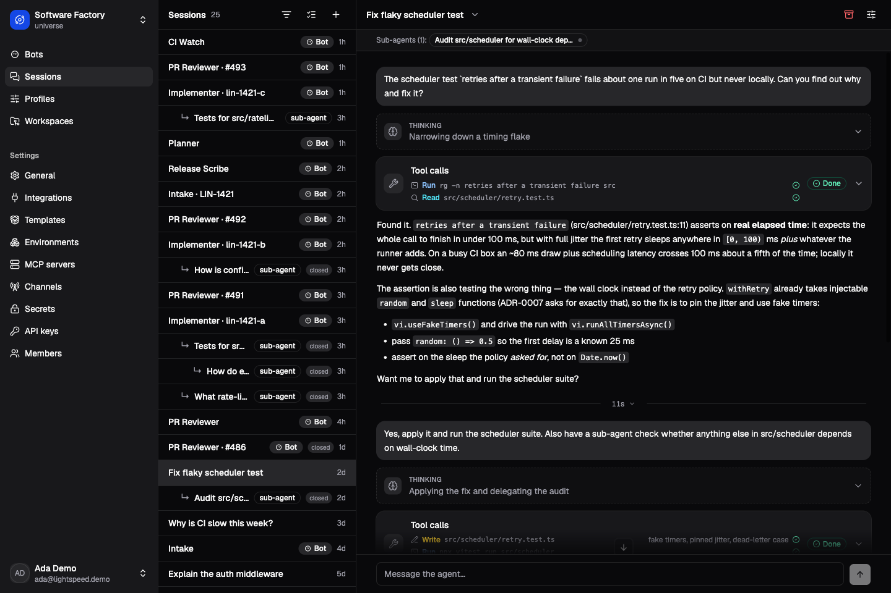

# Lightspeed documentation

Lightspeed runs long-lived agents as durable workflows. Sessions retain their
conversation and execution state across worker restarts, and agents can use
tools, work with persistent files, and react to events. When a task needs an
operating system, the session selects an execution environment that supplies
the machine.

The distinction between the durable session and its compute runs through the
product. You can start with a model and a conversation, add a workspace and a
reusable profile, then connect machines or build bots as the work requires.

*The Software Factory demo: a session investigates a flaky test, uses tools,
and delegates an audit. The conversation and its work stay together in one place.*

## Try Lightspeed

Begin with [Core concepts](getting-started/concepts.md) to understand sessions,
runs, profiles, bots, workspaces, and environments. Then follow
[Get started with Lightspeed](getting-started/quickstart.md) to choose a
prebuilt Linux release or a local source checkout and configure a model.

[Build your first agent](getting-started/first-agent.md) is a worked example:
create a release-editor profile, give it source material, and inspect the
persistent file it produces. It also shows how to continue a session and reuse
the profile for another conversation.

## Use an existing installation

Use the universe and account supplied by your operator. The
[model setup instructions](getting-started/quickstart.md#configure-a-model)
and [first-agent walkthrough](getting-started/first-agent.md) apply to an
existing installation too. Managing those resources requires a universe
owner/admin or platform administrator account.

The usage guides build on that first working agent:

- [Sessions and runs](using-lightspeed/sessions-and-runs.md): continue work,
  queue or steer tasks, inspect results, and manage history.
- [Models and credentials](using-lightspeed/models-and-credentials.md): connect
  providers, select model routes, and understand credential defaults.
- [Profiles and instructions](using-lightspeed/profiles-and-instructions.md):
  make a reusable setup and apply changes deliberately.
- [Workspaces and skills](using-lightspeed/workspaces-and-skills.md): share
  persistent files, source project instructions, and add a review skill.
- [Tools and MCP](using-lightspeed/tools-and-mcp.md): grant built-in tools,
  connect external services, and configure approvals.
- [Bots and triggers](using-lightspeed/bots-and-triggers.md): create an ongoing
  agent, deliver events, and inspect its activity.
- [Sub-agents and federation](using-lightspeed/subagents-and-federation.md):
  delegate bounded tasks or coordinate independent bots.
- [Chat channels](using-lightspeed/chat-channels.md): connect Telegram or
  WhatsApp and pair conversations with a bot.

When an agent needs a shell or a machine's files, read
[Environments](environments/overview.md). Connect a machine with
[Bring your own compute](environments/bring-your-own-compute.md) or configure
managed provisioning with [Incus VMs](environments/incus-vms.md). Then use
[Using environments](environments/using-environments.md) and
[Processes and jobs](environments/processes-and-jobs.md) for selection and
execution. [Credentials](environments/credentials.md),
[power and cleanup](environments/power-and-cleanup.md), and
[networking and ingress](environments/networking-and-ingress.md) explain
the access and lifecycle choices around that work.

## Deploy Lightspeed

The [deployment overview](deployment/overview.md) explains the runtime,
Platform, databases, Temporal, and the public/private network boundary.
[Self-host Lightspeed](deployment/self-hosting.md) installs the full web
product using release images built from a pinned source revision and existing
durable infrastructure.

Continue with these deployment guides:

- [Authentication and access](deployment/authentication-and-tenancy.md):
  configure gateway modes, create accounts, assign roles, and issue client keys.
- [Multitenancy](deployment/multi-tenancy.md): understand universe isolation,
  shared infrastructure, and tenant retirement.
- [Configuration](deployment/configuration.md): connect service settings,
  storage, secrets, and public/private URLs.
- [Operations](deployment/operations.md): observe useful work, scale roles,
  and manage retention.
- [Upgrades and recovery](deployment/upgrades-and-recovery.md): prepare a
  complete recovery set and update a coherent release.
- [Troubleshooting](deployment/troubleshooting.md): trace a failure across
  authentication, workers, models, compute, and chat delivery.

The [environment-variable reference](reference/environment-variables.md)
provides the exact names, defaults, and requirements for each component.

## Build with Lightspeed

Start with an integration path:

- [API and TypeScript](integrating-and-extending/api-and-typescript.md): submit
  a task, retry safely, follow events, and retrieve its result.
- [Configurator MCP](integrating-and-extending/configurator-mcp.md): connect
  an MCP client and manage resources in its authorized universe.
- [Workflow tools](integrating-and-extending/workflow-tools.md): connect an
  agent to durable receivers, started workflows, and lifecycle controllers.
- [Custom tools and model providers](integrating-and-extending/custom-tools-and-model-providers.md):
  choose an extension boundary and implement compiled capabilities when needed.
- [Environment providers](integrating-and-extending/environment-providers.md):
  supply managed compute through the public controller and data protocol.
- [Channel connectors](integrating-and-extending/channel-connectors.md): add a
  chat transport through account discovery, ingress, and connector activities.

The [JSON-RPC reference](../../crates/api/contract/api-reference.md) and
[workflow contract](../../crates/temporal-workflow/contract/workflow-contract.md)
provide exact operation and payload details.

## Understand how it works

The design walkthrough develops the system from a deterministic agent loop
into durable sessions, shared storage, and independent controllers:

- [Architecture](how-it-works/architecture.md): the layers, their ownership,
  and why the session harness is separate from compute.
- [Agent loop and durability](how-it-works/agent-loop-and-durability.md):
  admission, committed events, effects, the two histories, replay, and rollover.
- [Context and storage](how-it-works/context-and-storage.md): provider-native
  content, prompt assembly and caching, compaction, VFS, and blob retention.
- [Tools and controller workflows](how-it-works/tools-and-controller-workflows.md):
  tool identity, durable results, lifecycle ownership, bots, channels, and delegation.

## Develop Lightspeed

The development guides take a repository change from the local edit loop
through validation, contract generation, and release construction:

- [Local development](development/local-development.md): choose launcher
  profiles, find the owning code, edit and restart processes, and preview docs.
- [Testing and evaluation](development/testing-and-evaluation.md): choose
  focused tests, establish replay behavior, run live suites, and evaluate models.
- [Changing contracts](development/changing-contracts.md): update API and
  workflow consumers, preserve compatibility, and author database migrations.
- [Contributing and releasing](development/contributing-and-releasing.md):
  prepare a contribution and understand CI, packaging, snapshots, and publication.
